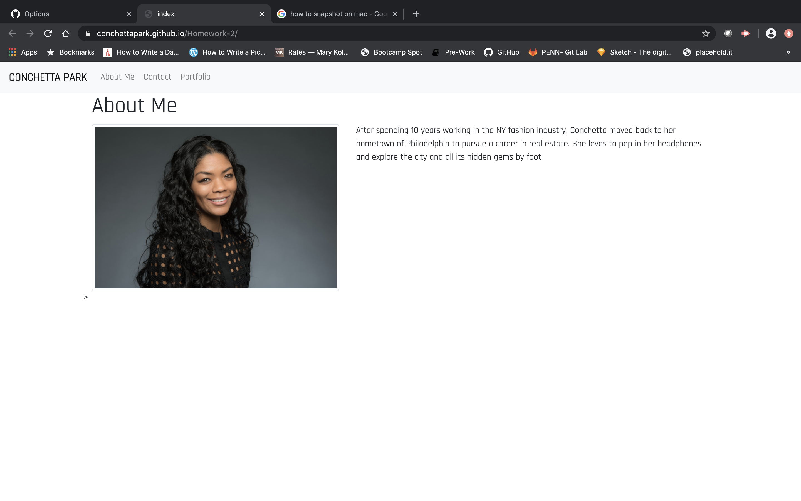
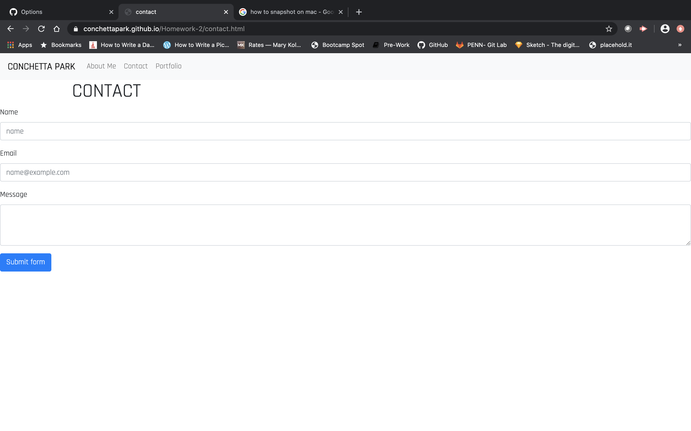

This is a responsive design layout for my protfolio.

I created index.html, portfolio.html, contact.html files to create 3 pages. Included are Bootstarp files: a Navbar, contact form and responsive layout, Bootstrap containers, rows and columns.
Included is adjusted sizing of layout from Small to Large screen and also Semantic HTML

https://conchettapark.github.io/Homework-2/index.html

